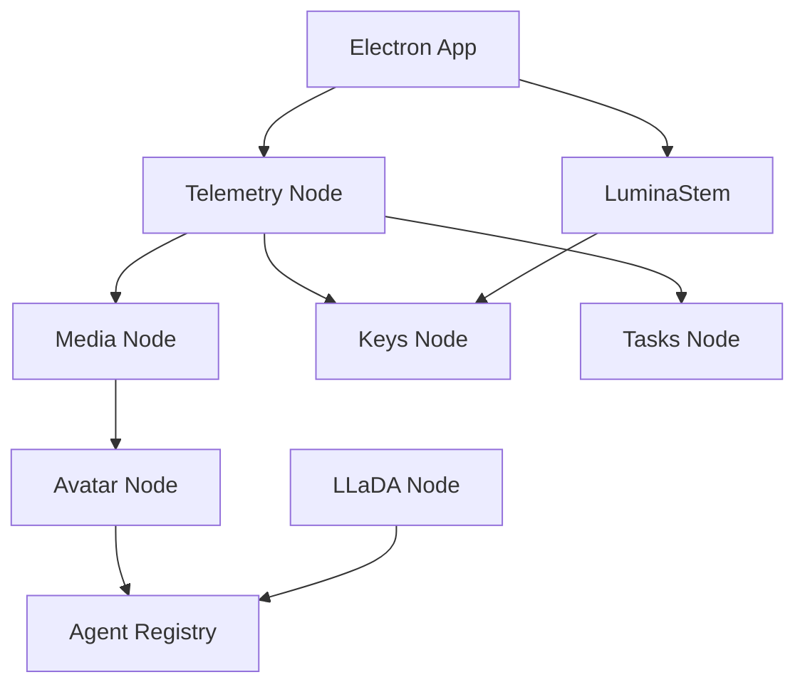

# Hapa Node Ecosystem Documentation

This repository contains the complete Hapa ecosystem, including the main Electron application and all supporting node services.

## Repository Structure

```
hapa-dev-proto/
├── electron/           # Main Electron application
├── src/               # React frontend components
├── nodes/             # All Hapa node services
│   ├── hapa-mlx-station/        # Media generation (MLX/mflux)
│   ├── hapa-telemetry-node/     # Monitoring & discovery
│   ├── hapa-llada-node/         # LLaDA 2.0 inference
│   ├── hapa-open-tasks-node/    # Task management
│   ├── hapa-keys-node/          # Key management
│   ├── hapa-avatar-node/        # Avatar generation
│   ├── hapa-agent-registry-node/# Agent registry
│   ├── hapa-luminastem-station/ # 3D music visualization
│   └── hapa-lore-node/          # Knowledge management
└── docs/              # Documentation

## Quick Start

### Main Application

```bash
# Install dependencies
npm install

# Run development mode
npm run dev

# Build for production
npm run build
```

### Node Services

Each node service can be run independently. See individual README files in `nodes/` directory.

#### Python-based Nodes

```bash
cd nodes/hapa-mlx-station
python3 -m venv .venv
source .venv/bin/activate
pip install -r requirements.txt
python -m hapa_media_node
```

#### Node.js-based Nodes

```bash
cd nodes/hapa-telemetry-node
npm install
npm start
```

## Node Services Overview

### Core Infrastructure

| Node | Port | Purpose | Technology |
|------|------|---------|------------|
| **hapa-telemetry-node** | 8730 | Central monitoring hub | Python/FastAPI |
| **hapa-keys-node** | 8733 | Secure key management | Python/FastAPI |
| **hapa-open-tasks-node** | 8733 | Task management | Node.js/Fastify |

### Media & Generation

| Node | Port | Purpose | Technology |
|------|------|---------|------------|
| **hapa-mlx-station** | 8723 | Image generation (FLUX) | Python/MLX |
| **hapa-avatar-node** | 8734 | Avatar expansion | Python/FastAPI |
| **hapa-luminastem-station** | 8732 | Music visualization | Python + React |

### Agent Services

| Node | Port | Purpose | Technology |
|------|------|---------|------------|
| **hapa-agent-registry-node** | 8735 | Agent discovery | Node.js/Hypercore |
| **hapa-llada-node** | 8085 | LLaDA inference | Python/MLX |
| **hapa-lore-node** | - | Knowledge base | Python/Markdown |

## Authentication

All Hapa nodes use bearer token authentication:

1. Tokens are auto-generated on first start
2. Stored in `.node_token` file in each node directory
3. Required for `/v1/*` API endpoints
4. Public `/health` endpoint for monitoring

## Integration Architecture



## Development

### Adding a New Node

1. Create directory in `nodes/`
2. Follow Hapa node standards:
   - Bearer token auth
   - `/health` endpoint
   - `/capabilities` endpoint
   - Self-test harness
3. Register with telemetry node
4. Document in README

### Testing

Run tests for all nodes:

```bash
# Python nodes
cd nodes/hapa-mlx-station
python -m hapa_media_node self-test

# Node.js nodes
cd nodes/hapa-telemetry-node
npm test
```

## Deployment

### Local Development

All nodes default to loopback (127.0.0.1) for security. This is the recommended configuration for development.

### Production

For production deployment:

1. Configure environment variables
2. Set up proper authentication tokens
3. Configure port forwarding/reverse proxy
4. Enable monitoring via telemetry node

## Documentation

- [Main App Documentation](./README.md)
- [Node Services Documentation](./nodes/README.md)
- [Overwatch Protocols](../.Overwatch/)
- Individual node READMEs in each `nodes/*/README.md`

## Support

For issues and questions:
- Check individual node documentation
- See Overwatch protocols in `.Overwatch/`
- Review comms protocols in `docs/.mind/Comms/`

## License

Proprietary - Hapa.AI
